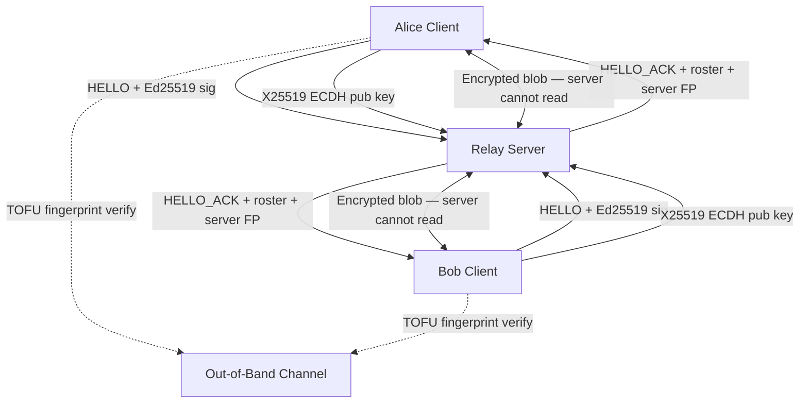
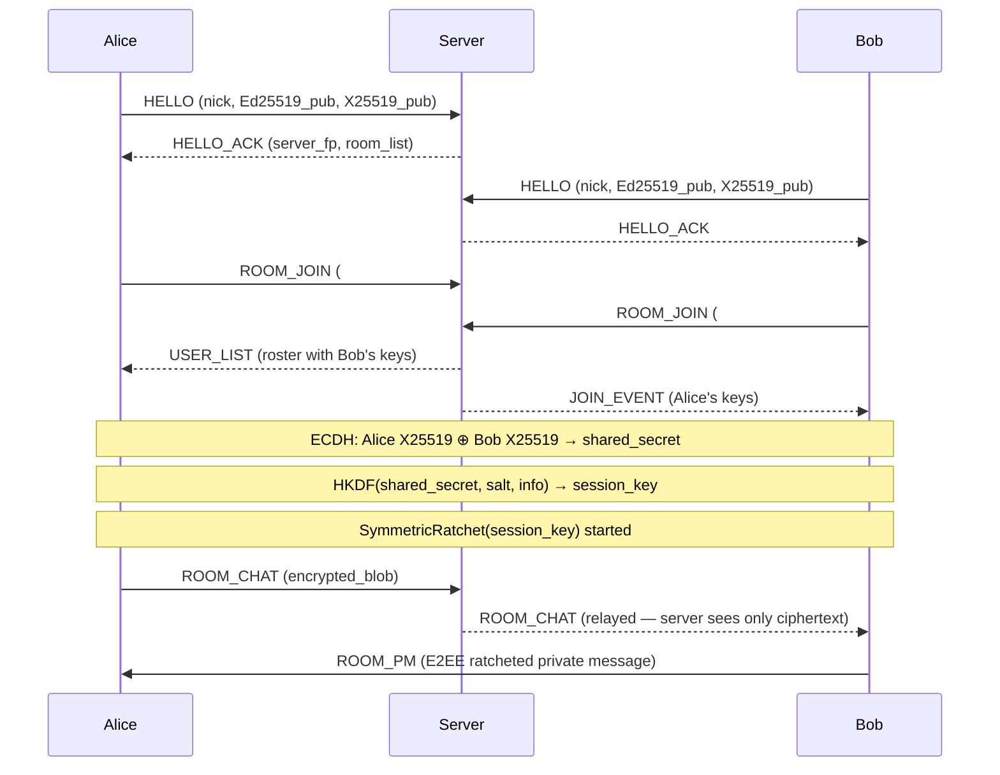

# 🔐 secure-term-chat

> Ultra-secure, end-to-end encrypted terminal chat room in Python 3.12+.  
> **Zero persistence. Zero logs. RAM-only. Open-source.**

[](https://python.org)
[](LICENSE)
[]()

---

## ✨ Features

| Feature | Detail |
|---|---|
| **Key Exchange** | X25519 ECDH (ephemeral per session) |
| **Encryption** | XChaCha20-Poly1305 (AEAD) |
| **Key Derivation** | HKDF-SHA512 (session + room keys) |
| **Identity** | Ed25519 signatures, TOFU fingerprints |
| **Forward Secrecy** | Double Ratchet-inspired symmetric ratchet |
| **Anti-Replay** | Nonce + timestamp validation (±30s) |
| **Group Chat** | Per-room HKDF keys |
| **Private Messages** | P2P ratchet-encrypted |
| **File Transfer** | 64 KB chunked, encrypted streaming |
| **TUI** | Textual multi-pane (chat + users + fingerprints) |
| **RAM-only** | No logs, no persistence, keys wiped on exit |

---

## 📦 Installation

```bash
git clone https://github.com/Gzeu/secure-term-chat
cd secure-term-chat
pip install cryptography pynacl textual
```

---

## 🚀 Quick Start

### 1. Start the server

```bash
python server.py --port 12345
```

The server prints its **fingerprint** — verify it out-of-band with participants.

### 2. Connect clients (different terminals)

```bash
# Terminal 1
python client.py localhost:12345 --nick Alice --room default

# Terminal 2  
python client.py localhost:12345 --nick Bob --room default

# Terminal 3 (different room)
python client.py localhost:12345 --nick Charlie --room secret
```

### 3. Verify fingerprints

When a peer joins, their Ed25519 fingerprint appears colored:
- 🟢 `[NEW]` — first time seen, stored in TOFU
- 🟢 `[OK]` — fingerprint matches TOFU store  
- 🔴 `[⚠ MISMATCH]` — fingerprint changed! **Do not trust!**

Verify fingerprints out-of-band (phone call, Signal, etc.).

---

## 💬 Commands

| Command | Description |
|---|---|
| `/join #room` | Switch to a different room |
| `/pm @user message` | Send encrypted private message |
| `/keys` | Display all known fingerprints |
| `/verify @user` | Show peer fingerprint for OOB verification |
| `/filesend path/to/file` | Send encrypted file to current room |
| `/users` | List users in current room |
| `/quit` | Disconnect and wipe keys |

---

## 🏗️ Architecture





---

## 🔐 Cryptographic Design

### Key Hierarchy

```
Ed25519 Identity Key  (long-lived, for signatures + TOFU)
    └── X25519 Session Key  (ephemeral per session)
            └── ECDH Shared Secret
                    └── HKDF-SHA512
                            ├── Session Enc Key (32 bytes)
                            ├── Room Key = HKDF(session_key, room_name)
                            └── Ratchet Root Key
                                    ├── chain_key_0 → msg_key_0 (XChaCha20-Poly1305)
                                    ├── chain_key_1 → msg_key_1
                                    └── chain_key_N → msg_key_N  (PFS: old keys wiped)
```

### XChaCha20-Poly1305

- 24-byte nonce (avoids nonce reuse risk of ChaCha20's 12-byte)
- Nonce extension via HChaCha20 subkey derivation (HKDF-based)
- AEAD: ciphertext authenticated with Poly1305 MAC
- Fresh random nonce per message

### Anti-Replay

```
Each frame contains:
  nonce_id  [32 random bytes] — unique per message
  timestamp [float64]        — signed, validated ±30s

Server + client maintain sliding window of seen nonces.
Duplicate or stale frames are silently dropped.
```

### Forward Secrecy (Ratchet)

```python
# Each message advances the chain:
msg_key   = HKDF(chain_key, "msg",   counter)  # used once then wiped
chain_key = HKDF(chain_key, "chain", counter)  # replaces old chain_key
# Old chain_key is overwritten in memory → past messages protected
```

---

## 🛡️ Security Properties

| Property | Status |
|---|---|
| End-to-End Encryption | ✅ Server sees only ciphertext |
| Forward Secrecy | ✅ Ratchet wipes old keys |
| Break-in Recovery | ⚠️ Partial (session-level, no full DR) |
| Replay Protection | ✅ Nonce + timestamp |
| Authentication | ✅ Ed25519 + TOFU |
| DoS Protection | ✅ Rate limiting + queue caps |
| Key Compromise (server) | ✅ Server has no message keys |
| RAM-only | ✅ No disk writes |
| Metadata Leakage | ⚠️ Server sees nicks, rooms, timing |

---

## 🧪 Security Tests

### Run crypto unit tests

```bash
python utils.py
```

Expected output:
```
[TEST] Identity Key Generation
  Fingerprint: a1b2:c3d4:...
[TEST] X25519 ECDH Key Exchange
  Shared secrets match ✓
[TEST] HKDF Key Derivation
  Derived key: ...
[TEST] XChaCha20-Poly1305 Encrypt/Decrypt
  Encrypt/Decrypt OK ✓
[TEST] Anti-Replay Filter
  Replay blocked ✓
[TEST] Symmetric Ratchet (Forward Secrecy)
  Ratchet 5 messages OK ✓
[TEST] Wire Frame Build/Parse
  Frame sign/verify OK ✓

[ALL TESTS PASSED] ✓
```

### Multi-client test (3 terminals)

```bash
# T1:
python server.py --port 12345

# T2:
python client.py localhost:12345 --nick Alice --room test

# T3:
python client.py localhost:12345 --nick Bob --room test
# Bob sees Alice's fingerprint → verify via T2
# Send messages — Bob can read them, server cannot
```

### Replay Attack Test

Send same message frame twice:
```bash
# AntiReplayFilter will reject duplicate nonce_id
# Output: [WARN] Replay/stale frame from Alice
```

### PFS Test (New Session = Old Encrypted Safe)

```bash
# Step 1: Record encrypted frames from a session
# Step 2: Restart client (new ephemeral X25519 key generated)
# Step 3: Old frames cannot be decrypted — shared secret changed
```

### Server Key Compromise Test

```bash
# Server holds: server identity key (for frame signing/ACKs)
# Server does NOT hold: session keys, room keys, message keys
# Compromising server.py reveals: who connected, when, to which rooms
# Does NOT reveal: message content (all ciphertext, keys are client-side)
```

---

## 📁 File Structure

```
secure-term-chat/
├── server.py      # Discovery & relay server (asyncio TCP)
├── client.py      # TUI client (Textual + asyncio)
├── utils.py       # Crypto primitives + wire protocol
├── README.md
└── LICENSE
```

---

## ⚙️ Configuration

```bash
# Server options
python server.py --host 0.0.0.0 --port 12345 --debug

# Client options
python client.py host:port --nick NICKNAME --room ROOM
```

---

## 📊 Performance (Approximate)

| Operation | ~Speed |
|---|---|
| XChaCha20-Poly1305 encrypt (1KB) | < 0.1ms |
| ECDH key exchange | < 1ms |
| HKDF-SHA512 | < 0.5ms |
| Ed25519 sign | < 1ms |
| File chunk encrypt (64KB) | < 2ms |

---

## ⚠️ Limitations & Future Work

- **Group chat ratchet**: Currently uses a shared room key per session (not full Double Ratchet per sender). For highest security group chats, use Signal-style Sender Keys.
- **Metadata**: Server knows nicks, room names, connection timing.
- **No P2P/WebRTC**: Relay-only. Direct P2P via ICE/STUN would bypass server entirely.
- **Key persistence**: Intentional RAM-only; add optional encrypted keystore for identity persistence.

---

## 📜 License

MIT License — see [LICENSE](LICENSE)

---

*Built with ❤️ for privacy. Verify fingerprints. Trust no one blindly.*
